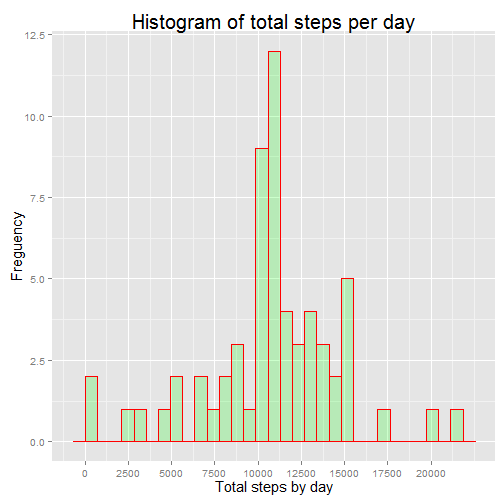

```r
library(knitr)

#Set global options - echo is set to TRUE by default so that I do not need to set
# this for every code chunk.
opts_chunk$set(echo = TRUE, results = "hide")

suppressWarnings(suppressMessages(library(dplyr)))
suppressWarnings(suppressMessages(library(ggplot2)))
library(grid)
library(xtable)
```

## Loading and preprocessing the data.


```r
data <- read.table("activity.csv", sep=",", header=TRUE, na.strings="NA")
```

## 1. What is the mean total number of steps taken per day?

### 1.1 - Calculate total number of steps taken per day


```r
agg <- aggregate(data[,1], list(date=data$date), FUN=sum, na.rm=TRUE)
```

### 1.2 - Histogram of the total number of steps taken per day.


```r
#Creating histogram plot using the aggregated data calculated in chunk above.
p <- ggplot(agg, aes(agg$x)) + 
  geom_histogram( col="red", fill="green", alpha= .2) +
  theme(axis.text.x = element_text(size=10),
        axis.text.y = element_text(size=10),
        axis.title.x = element_text(size=15),
        axis.title.y = element_text(size=15),
        plot.title = element_text(size=20),
        plot.margin=unit(c(3,3,3,2), "mm")) +
  labs(y = "Freguency") +
  labs(x = "Total steps a day") + 
  labs(title = "Histogram of total steps a day") + 
  scale_x_continuous(breaks = c(0, 2500, 5000,7500,10000,12500,15000,17500,20000))

print(p)
```

 

### 1.3 - Mean and median of the total number of steps taken per day.


```r
summary <- data %>% 
            group_by(date) %>% 
            summarise(MEAN = mean(steps), MEDIAN=median(steps))
```

Table 1 below shows the mean and median of total number of steps per day.


```r
xt <- xtable(summary, caption.placement="top", caption = "Table 1 - Mean and 
             median of total steps per day", align="cccc")

print(xt, type="html", include.rownames=FALSE)
```

<!-- html table generated in R 3.1.3 by xtable 1.8-0 package -->
<!-- Mon Jun 08 21:53:33 2015 -->
<table border=1>
<caption align="bottom"> Table 1 - Mean and 
             median of total steps per day </caption>
<tr> <th> date </th> <th> MEAN </th> <th> MEDIAN </th>  </tr>
  <tr> <td align="center"> 2012-10-01 </td> <td align="center">  </td> <td align="center">  </td> </tr>
  <tr> <td align="center"> 2012-10-02 </td> <td align="center"> 0.44 </td> <td align="center"> 0.00 </td> </tr>
  <tr> <td align="center"> 2012-10-03 </td> <td align="center"> 39.42 </td> <td align="center"> 0.00 </td> </tr>
  <tr> <td align="center"> 2012-10-04 </td> <td align="center"> 42.07 </td> <td align="center"> 0.00 </td> </tr>
  <tr> <td align="center"> 2012-10-05 </td> <td align="center"> 46.16 </td> <td align="center"> 0.00 </td> </tr>
  <tr> <td align="center"> 2012-10-06 </td> <td align="center"> 53.54 </td> <td align="center"> 0.00 </td> </tr>
  <tr> <td align="center"> 2012-10-07 </td> <td align="center"> 38.25 </td> <td align="center"> 0.00 </td> </tr>
  <tr> <td align="center"> 2012-10-08 </td> <td align="center">  </td> <td align="center">  </td> </tr>
  <tr> <td align="center"> 2012-10-09 </td> <td align="center"> 44.48 </td> <td align="center"> 0.00 </td> </tr>
  <tr> <td align="center"> 2012-10-10 </td> <td align="center"> 34.38 </td> <td align="center"> 0.00 </td> </tr>
  <tr> <td align="center"> 2012-10-11 </td> <td align="center"> 35.78 </td> <td align="center"> 0.00 </td> </tr>
  <tr> <td align="center"> 2012-10-12 </td> <td align="center"> 60.35 </td> <td align="center"> 0.00 </td> </tr>
  <tr> <td align="center"> 2012-10-13 </td> <td align="center"> 43.15 </td> <td align="center"> 0.00 </td> </tr>
  <tr> <td align="center"> 2012-10-14 </td> <td align="center"> 52.42 </td> <td align="center"> 0.00 </td> </tr>
  <tr> <td align="center"> 2012-10-15 </td> <td align="center"> 35.20 </td> <td align="center"> 0.00 </td> </tr>
  <tr> <td align="center"> 2012-10-16 </td> <td align="center"> 52.38 </td> <td align="center"> 0.00 </td> </tr>
  <tr> <td align="center"> 2012-10-17 </td> <td align="center"> 46.71 </td> <td align="center"> 0.00 </td> </tr>
  <tr> <td align="center"> 2012-10-18 </td> <td align="center"> 34.92 </td> <td align="center"> 0.00 </td> </tr>
  <tr> <td align="center"> 2012-10-19 </td> <td align="center"> 41.07 </td> <td align="center"> 0.00 </td> </tr>
  <tr> <td align="center"> 2012-10-20 </td> <td align="center"> 36.09 </td> <td align="center"> 0.00 </td> </tr>
  <tr> <td align="center"> 2012-10-21 </td> <td align="center"> 30.63 </td> <td align="center"> 0.00 </td> </tr>
  <tr> <td align="center"> 2012-10-22 </td> <td align="center"> 46.74 </td> <td align="center"> 0.00 </td> </tr>
  <tr> <td align="center"> 2012-10-23 </td> <td align="center"> 30.97 </td> <td align="center"> 0.00 </td> </tr>
  <tr> <td align="center"> 2012-10-24 </td> <td align="center"> 29.01 </td> <td align="center"> 0.00 </td> </tr>
  <tr> <td align="center"> 2012-10-25 </td> <td align="center"> 8.65 </td> <td align="center"> 0.00 </td> </tr>
  <tr> <td align="center"> 2012-10-26 </td> <td align="center"> 23.53 </td> <td align="center"> 0.00 </td> </tr>
  <tr> <td align="center"> 2012-10-27 </td> <td align="center"> 35.14 </td> <td align="center"> 0.00 </td> </tr>
  <tr> <td align="center"> 2012-10-28 </td> <td align="center"> 39.78 </td> <td align="center"> 0.00 </td> </tr>
  <tr> <td align="center"> 2012-10-29 </td> <td align="center"> 17.42 </td> <td align="center"> 0.00 </td> </tr>
  <tr> <td align="center"> 2012-10-30 </td> <td align="center"> 34.09 </td> <td align="center"> 0.00 </td> </tr>
  <tr> <td align="center"> 2012-10-31 </td> <td align="center"> 53.52 </td> <td align="center"> 0.00 </td> </tr>
  <tr> <td align="center"> 2012-11-01 </td> <td align="center">  </td> <td align="center">  </td> </tr>
  <tr> <td align="center"> 2012-11-02 </td> <td align="center"> 36.81 </td> <td align="center"> 0.00 </td> </tr>
  <tr> <td align="center"> 2012-11-03 </td> <td align="center"> 36.70 </td> <td align="center"> 0.00 </td> </tr>
  <tr> <td align="center"> 2012-11-04 </td> <td align="center">  </td> <td align="center">  </td> </tr>
  <tr> <td align="center"> 2012-11-05 </td> <td align="center"> 36.25 </td> <td align="center"> 0.00 </td> </tr>
  <tr> <td align="center"> 2012-11-06 </td> <td align="center"> 28.94 </td> <td align="center"> 0.00 </td> </tr>
  <tr> <td align="center"> 2012-11-07 </td> <td align="center"> 44.73 </td> <td align="center"> 0.00 </td> </tr>
  <tr> <td align="center"> 2012-11-08 </td> <td align="center"> 11.18 </td> <td align="center"> 0.00 </td> </tr>
  <tr> <td align="center"> 2012-11-09 </td> <td align="center">  </td> <td align="center">  </td> </tr>
  <tr> <td align="center"> 2012-11-10 </td> <td align="center">  </td> <td align="center">  </td> </tr>
  <tr> <td align="center"> 2012-11-11 </td> <td align="center"> 43.78 </td> <td align="center"> 0.00 </td> </tr>
  <tr> <td align="center"> 2012-11-12 </td> <td align="center"> 37.38 </td> <td align="center"> 0.00 </td> </tr>
  <tr> <td align="center"> 2012-11-13 </td> <td align="center"> 25.47 </td> <td align="center"> 0.00 </td> </tr>
  <tr> <td align="center"> 2012-11-14 </td> <td align="center">  </td> <td align="center">  </td> </tr>
  <tr> <td align="center"> 2012-11-15 </td> <td align="center"> 0.14 </td> <td align="center"> 0.00 </td> </tr>
  <tr> <td align="center"> 2012-11-16 </td> <td align="center"> 18.89 </td> <td align="center"> 0.00 </td> </tr>
  <tr> <td align="center"> 2012-11-17 </td> <td align="center"> 49.79 </td> <td align="center"> 0.00 </td> </tr>
  <tr> <td align="center"> 2012-11-18 </td> <td align="center"> 52.47 </td> <td align="center"> 0.00 </td> </tr>
  <tr> <td align="center"> 2012-11-19 </td> <td align="center"> 30.70 </td> <td align="center"> 0.00 </td> </tr>
  <tr> <td align="center"> 2012-11-20 </td> <td align="center"> 15.53 </td> <td align="center"> 0.00 </td> </tr>
  <tr> <td align="center"> 2012-11-21 </td> <td align="center"> 44.40 </td> <td align="center"> 0.00 </td> </tr>
  <tr> <td align="center"> 2012-11-22 </td> <td align="center"> 70.93 </td> <td align="center"> 0.00 </td> </tr>
  <tr> <td align="center"> 2012-11-23 </td> <td align="center"> 73.59 </td> <td align="center"> 0.00 </td> </tr>
  <tr> <td align="center"> 2012-11-24 </td> <td align="center"> 50.27 </td> <td align="center"> 0.00 </td> </tr>
  <tr> <td align="center"> 2012-11-25 </td> <td align="center"> 41.09 </td> <td align="center"> 0.00 </td> </tr>
  <tr> <td align="center"> 2012-11-26 </td> <td align="center"> 38.76 </td> <td align="center"> 0.00 </td> </tr>
  <tr> <td align="center"> 2012-11-27 </td> <td align="center"> 47.38 </td> <td align="center"> 0.00 </td> </tr>
  <tr> <td align="center"> 2012-11-28 </td> <td align="center"> 35.36 </td> <td align="center"> 0.00 </td> </tr>
  <tr> <td align="center"> 2012-11-29 </td> <td align="center"> 24.47 </td> <td align="center"> 0.00 </td> </tr>
  <tr> <td align="center"> 2012-11-30 </td> <td align="center">  </td> <td align="center">  </td> </tr>
   </table>

## 2. What is the daily activity pattern?

### 2.1  Time series plot of the 5-minute interval and the average number of steps taken, averaged across all days.

Calculate the average number of steps per 5-minute time interval across all days.


```r
avg_ints <- data %>% 
        group_by(interval) %>%
        summarise(AVERAGE = mean(steps, na.rm=TRUE))
```

Time series plot for average number of steps per time interval.


```r
tp <- ggplot(avg_ints, aes(interval, AVERAGE)) +
        geom_line(col="blue", size=1) +
        theme(axis.text.x = element_text(size=10),
                axis.text.y = element_text(size=10),
                axis.title.x = element_text(size=15),
                axis.title.y = element_text(size=15),
                plot.title = element_text(size=20),
                plot.margin=unit(c(3,3,3,2), "mm")) + 
        labs(x = "5 - minute intervals") +
        labs(y = "Average number of steps") + 
        labs(title = "Daily Activity Pattern") + 
        scale_x_continuous(breaks = c(0, 250, 500, 750, 1000, 1250, 1500, 1750, 
                                      2000, 2250)) 
print(tp)
```

 

### 2.2 Which 5-minute interval, on average across all the days in the dataset, contains the maximum number of steps.


```r
maxinterval <- avg_ints[which.max(avg_ints$AVERAGE),]
```

Interval 835 contains the maximum number of steps and the 
average for this interval is equals to 206. 

## 3.  Inputing missing Values

### 3.1  Total number of missing values in data.


```r
#Get the total rows and deduct the complete rows i.e rows with no NA values.
#This will give one the number of missing values.
na_count <- nrow(data) - sum(complete.cases(data))
```

There are 2304 missing values in the data set.

### 3.2  Replace missing values with the mean for that 5-minute interval.


```r
#Create a new dataset "data2" by merging "data"" with the 5-minute interval means
#in dataset "avg_ints".
data2 <- merge(data, avg_ints, all=TRUE)

#Order data by date and inteval.
data2 <- arrange(data2, date, interval)

#Replace all NA values with the average values for that 5-minute interval.  
data2$steps[is.na(data2$steps)] <- data2$AVERAGE[is.na(data2$steps)]

#Discard columns not present in original data set.
data2 <- select(data2, steps, date, interval)
```

### 3.3 Histogram 

Below is a histogram of the newly created data set "data2".  It consist of the original data, but with the missing values replaced by the average of the corresponding 5-minute interval.


```r
data2_summary <- data2 %>% 
                  group_by(date) %>%
                  summarise(TOTAL = sum(steps))

#Creating histogram plot.
pd2 <- ggplot(data2_summary, aes(data2_summary$TOTAL)) + 
  geom_histogram(col="red", fill="green", alpha= .2) +
  theme(axis.text.x = element_text(size=10),
        axis.text.y = element_text(size=10),
        axis.title.x = element_text(size=15),
        axis.title.y = element_text(size=15),
        plot.title = element_text(size=20),
        plot.margin=unit(c(3,3,3,2), "mm")) +
  labs(y = "Freguency") +
  labs(x = "Total steps by day") + 
  labs(title = "Histogram of total steps per day") +
  scale_x_continuous(breaks = c(0, 2500, 5000,7500,10000,12500,15000,17500,20000))

print(pd2)
```

 

The impact of the imputed missing values on the total daily number of steps is:

1. It produces a distribution that is more normal in appearance.  The first histogram seemed to be artificially skewed due to the missing values being interpreted as 0 steps for that day.  
2. There is a more pronounced "peak" in the distribution using the imputed values for the intervals between 10000 and 11250 steps.

### 3.4 Calculate the mean and median total number of steps per day.


```r
summ2 <- data2 %>% 
  group_by(date) %>% 
  summarise(MEAN = mean(steps), MEDIAN=median(steps))
```

Here is the mean and median of total number of steps per day.  Missing values is replaced by mean for corresponding 5 minute interval.


```r
library(xtable)
xt <- xtable(summ2, caption.placement="top", caption = "Table 2 - Mean and 
             median of total steps per day, including imputed values.", align="cccc")
print(xt, type="html", include.rownames=FALSE)
```

<!-- html table generated in R 3.1.3 by xtable 1.8-0 package -->
<!-- Mon Jun 08 21:53:34 2015 -->
<table border=1>
<caption align="bottom"> Table 2 - Mean and 
             median of total steps per day, including imputed values. </caption>
<tr> <th> date </th> <th> MEAN </th> <th> MEDIAN </th>  </tr>
  <tr> <td align="center"> 2012-10-01 </td> <td align="center"> 37.38 </td> <td align="center"> 34.11 </td> </tr>
  <tr> <td align="center"> 2012-10-02 </td> <td align="center"> 0.44 </td> <td align="center"> 0.00 </td> </tr>
  <tr> <td align="center"> 2012-10-03 </td> <td align="center"> 39.42 </td> <td align="center"> 0.00 </td> </tr>
  <tr> <td align="center"> 2012-10-04 </td> <td align="center"> 42.07 </td> <td align="center"> 0.00 </td> </tr>
  <tr> <td align="center"> 2012-10-05 </td> <td align="center"> 46.16 </td> <td align="center"> 0.00 </td> </tr>
  <tr> <td align="center"> 2012-10-06 </td> <td align="center"> 53.54 </td> <td align="center"> 0.00 </td> </tr>
  <tr> <td align="center"> 2012-10-07 </td> <td align="center"> 38.25 </td> <td align="center"> 0.00 </td> </tr>
  <tr> <td align="center"> 2012-10-08 </td> <td align="center"> 37.38 </td> <td align="center"> 34.11 </td> </tr>
  <tr> <td align="center"> 2012-10-09 </td> <td align="center"> 44.48 </td> <td align="center"> 0.00 </td> </tr>
  <tr> <td align="center"> 2012-10-10 </td> <td align="center"> 34.38 </td> <td align="center"> 0.00 </td> </tr>
  <tr> <td align="center"> 2012-10-11 </td> <td align="center"> 35.78 </td> <td align="center"> 0.00 </td> </tr>
  <tr> <td align="center"> 2012-10-12 </td> <td align="center"> 60.35 </td> <td align="center"> 0.00 </td> </tr>
  <tr> <td align="center"> 2012-10-13 </td> <td align="center"> 43.15 </td> <td align="center"> 0.00 </td> </tr>
  <tr> <td align="center"> 2012-10-14 </td> <td align="center"> 52.42 </td> <td align="center"> 0.00 </td> </tr>
  <tr> <td align="center"> 2012-10-15 </td> <td align="center"> 35.20 </td> <td align="center"> 0.00 </td> </tr>
  <tr> <td align="center"> 2012-10-16 </td> <td align="center"> 52.38 </td> <td align="center"> 0.00 </td> </tr>
  <tr> <td align="center"> 2012-10-17 </td> <td align="center"> 46.71 </td> <td align="center"> 0.00 </td> </tr>
  <tr> <td align="center"> 2012-10-18 </td> <td align="center"> 34.92 </td> <td align="center"> 0.00 </td> </tr>
  <tr> <td align="center"> 2012-10-19 </td> <td align="center"> 41.07 </td> <td align="center"> 0.00 </td> </tr>
  <tr> <td align="center"> 2012-10-20 </td> <td align="center"> 36.09 </td> <td align="center"> 0.00 </td> </tr>
  <tr> <td align="center"> 2012-10-21 </td> <td align="center"> 30.63 </td> <td align="center"> 0.00 </td> </tr>
  <tr> <td align="center"> 2012-10-22 </td> <td align="center"> 46.74 </td> <td align="center"> 0.00 </td> </tr>
  <tr> <td align="center"> 2012-10-23 </td> <td align="center"> 30.97 </td> <td align="center"> 0.00 </td> </tr>
  <tr> <td align="center"> 2012-10-24 </td> <td align="center"> 29.01 </td> <td align="center"> 0.00 </td> </tr>
  <tr> <td align="center"> 2012-10-25 </td> <td align="center"> 8.65 </td> <td align="center"> 0.00 </td> </tr>
  <tr> <td align="center"> 2012-10-26 </td> <td align="center"> 23.53 </td> <td align="center"> 0.00 </td> </tr>
  <tr> <td align="center"> 2012-10-27 </td> <td align="center"> 35.14 </td> <td align="center"> 0.00 </td> </tr>
  <tr> <td align="center"> 2012-10-28 </td> <td align="center"> 39.78 </td> <td align="center"> 0.00 </td> </tr>
  <tr> <td align="center"> 2012-10-29 </td> <td align="center"> 17.42 </td> <td align="center"> 0.00 </td> </tr>
  <tr> <td align="center"> 2012-10-30 </td> <td align="center"> 34.09 </td> <td align="center"> 0.00 </td> </tr>
  <tr> <td align="center"> 2012-10-31 </td> <td align="center"> 53.52 </td> <td align="center"> 0.00 </td> </tr>
  <tr> <td align="center"> 2012-11-01 </td> <td align="center"> 37.38 </td> <td align="center"> 34.11 </td> </tr>
  <tr> <td align="center"> 2012-11-02 </td> <td align="center"> 36.81 </td> <td align="center"> 0.00 </td> </tr>
  <tr> <td align="center"> 2012-11-03 </td> <td align="center"> 36.70 </td> <td align="center"> 0.00 </td> </tr>
  <tr> <td align="center"> 2012-11-04 </td> <td align="center"> 37.38 </td> <td align="center"> 34.11 </td> </tr>
  <tr> <td align="center"> 2012-11-05 </td> <td align="center"> 36.25 </td> <td align="center"> 0.00 </td> </tr>
  <tr> <td align="center"> 2012-11-06 </td> <td align="center"> 28.94 </td> <td align="center"> 0.00 </td> </tr>
  <tr> <td align="center"> 2012-11-07 </td> <td align="center"> 44.73 </td> <td align="center"> 0.00 </td> </tr>
  <tr> <td align="center"> 2012-11-08 </td> <td align="center"> 11.18 </td> <td align="center"> 0.00 </td> </tr>
  <tr> <td align="center"> 2012-11-09 </td> <td align="center"> 37.38 </td> <td align="center"> 34.11 </td> </tr>
  <tr> <td align="center"> 2012-11-10 </td> <td align="center"> 37.38 </td> <td align="center"> 34.11 </td> </tr>
  <tr> <td align="center"> 2012-11-11 </td> <td align="center"> 43.78 </td> <td align="center"> 0.00 </td> </tr>
  <tr> <td align="center"> 2012-11-12 </td> <td align="center"> 37.38 </td> <td align="center"> 0.00 </td> </tr>
  <tr> <td align="center"> 2012-11-13 </td> <td align="center"> 25.47 </td> <td align="center"> 0.00 </td> </tr>
  <tr> <td align="center"> 2012-11-14 </td> <td align="center"> 37.38 </td> <td align="center"> 34.11 </td> </tr>
  <tr> <td align="center"> 2012-11-15 </td> <td align="center"> 0.14 </td> <td align="center"> 0.00 </td> </tr>
  <tr> <td align="center"> 2012-11-16 </td> <td align="center"> 18.89 </td> <td align="center"> 0.00 </td> </tr>
  <tr> <td align="center"> 2012-11-17 </td> <td align="center"> 49.79 </td> <td align="center"> 0.00 </td> </tr>
  <tr> <td align="center"> 2012-11-18 </td> <td align="center"> 52.47 </td> <td align="center"> 0.00 </td> </tr>
  <tr> <td align="center"> 2012-11-19 </td> <td align="center"> 30.70 </td> <td align="center"> 0.00 </td> </tr>
  <tr> <td align="center"> 2012-11-20 </td> <td align="center"> 15.53 </td> <td align="center"> 0.00 </td> </tr>
  <tr> <td align="center"> 2012-11-21 </td> <td align="center"> 44.40 </td> <td align="center"> 0.00 </td> </tr>
  <tr> <td align="center"> 2012-11-22 </td> <td align="center"> 70.93 </td> <td align="center"> 0.00 </td> </tr>
  <tr> <td align="center"> 2012-11-23 </td> <td align="center"> 73.59 </td> <td align="center"> 0.00 </td> </tr>
  <tr> <td align="center"> 2012-11-24 </td> <td align="center"> 50.27 </td> <td align="center"> 0.00 </td> </tr>
  <tr> <td align="center"> 2012-11-25 </td> <td align="center"> 41.09 </td> <td align="center"> 0.00 </td> </tr>
  <tr> <td align="center"> 2012-11-26 </td> <td align="center"> 38.76 </td> <td align="center"> 0.00 </td> </tr>
  <tr> <td align="center"> 2012-11-27 </td> <td align="center"> 47.38 </td> <td align="center"> 0.00 </td> </tr>
  <tr> <td align="center"> 2012-11-28 </td> <td align="center"> 35.36 </td> <td align="center"> 0.00 </td> </tr>
  <tr> <td align="center"> 2012-11-29 </td> <td align="center"> 24.47 </td> <td align="center"> 0.00 </td> </tr>
  <tr> <td align="center"> 2012-11-30 </td> <td align="center"> 37.38 </td> <td align="center"> 34.11 </td> </tr>
   </table>

I thought I would answer the question regarding the difference between the median and mean for the two data sets by creating two plots.

The plot below show a comparison between the mean total number of steps per day between the orginal data set and the data that were imputed with average values per 5-minute interval.  From the plot it is clear that the mean values is identical, except for those days where no readings were taken.  Those days are clearly highlighted by the red line being "broken" or absent, with only the blue line present.


```r
cp <- ggplot() +
  geom_line(data=summ2, aes(date, MEAN, col="blue", group=1)) + 
  geom_line(data=summary, aes(date, MEAN, group=1, col="red"), size = 2, alpha = 0.2) + 
  theme(axis.text.x = element_text(angle=90, hjust=1),
        axis.title.x = element_text(size=15),
        axis.title.y = element_text(size=15),
        plot.title = element_text(size=20))+ 
  labs(x = "Date") + 
  labs(y = "Mean total number of steps per day") + 
  labs(title = "Imputed vs Original") + 
  scale_colour_manual(name = "data", values=c("red" = "red", "blue"="blue"), labels = c('Imputed', 'Original'))

print(cp)
```

```
## Warning in loop_apply(n, do.ply): Removed 2 rows containing missing values
## (geom_path).
```

 

The plot below show that similar to the mean, the median is identical between the two data sets apart from the days that all data were missing from.  Those days are highlighted by the blue line and the absence of the red line.  This would indicate that the strategy that I have chosen, i.e. using the mean for corresponding 5-minute intervals might not be recommended as it clearly distorts the median of the original data.


```r
cp <- ggplot() +
  geom_line(data=summ2, aes(date, MEDIAN, col="blue", group=1)) + 
  geom_line(data=summary, aes(date, MEDIAN, group=1, col="red"), size = 2, alpha = 0.2) + 
  theme(axis.text.x = element_text(angle=90, hjust=1),
        axis.title.x = element_text(size=15),
        axis.title.y = element_text(size=15),
        plot.title = element_text(size=20))+ 
  labs(x = "Date") + 
  labs(y = "Median total number of steps per day") + 
  labs(title = "Imputed vs Original") + 
  scale_colour_manual(name = "data", values=c("red" = "red", "blue"="blue"), labels = c('Imputed', 'Original'))

suppressWarnings(suppressMessages(print(cp)))
```

 

## 4. Weekday and Weekend activity patterns.

The code chunk below creates a new factor variable with two levels, classifying a date as being a weekday or weekend.  I then calculate the mean per 5-minute interval across all weekdays and weekend days seperately.


```r
#Convert the date column to Date type.
data2$date <- as.Date(as.character(data2$date), "%Y-%m-%d") 

#Create a new column and get the weekday for the date.
data2$weekdays <- weekdays(data2$date)

#Create a Factor column classifying Weekend days as TRUE.
data2$IsWeekend <- data2$weekdays %in% c("Saturday", "Sunday")

#Label the factor column.
data2$IsWeekend <- factor(data2$IsWeekend, levels = c("FALSE", "TRUE"), labels = c("weekday", "weekend"))

#Calculate the Mean number of steps per interval across all weekdays and weekends.
summ3 <- data2 %>% 
        group_by(IsWeekend, interval) %>% 
        summarise(MEAN = mean(steps))
```

The plot below shows a comparison between weekday and weekend activity profiles using the data generated by the code chunk above.  The plot highlights the following:

1. Activity seems to start earlier during the week than over weekends.  This is reflected by the higher mean for the intervals between 500 and 750.
2.  There seems to be more activity during the week than over weekends for the intervals between 750 and 900.
3.  From interval 1000 onwards there seems to be more activity over weekends than during the week.  This is reflected by the higher means for these intervals over weekends.


```r
#Using ggplot to create a multi panel plot of weekend vs weekday data.
wdp <- ggplot(summ3, aes(interval, MEAN)) +  
      geom_line(color="blue") +
      facet_wrap(~ IsWeekend, ncol=1) +
      theme_bw() + 
      theme(
            strip.background = element_rect(fill="orange"),
            strip.text = element_text(size=15),
            axis.title.x = element_text(size=15),
            axis.title.y = element_text(size=15),
            plot.title = element_text(size=20)) +
      labs(x = "interval") +
      labs(y = "Mean number of steps") +
      labs(title = "Weekend vs Weekday") +
      scale_x_continuous(breaks = c(0, 250, 500, 750, 1000, 1250, 1500, 1750, 
                                2000, 2250))

print(wdp)
```

 
